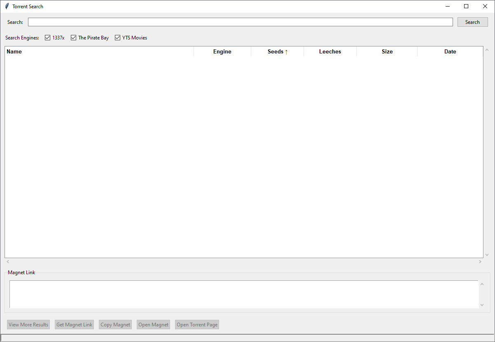

# Torrent Finder 🔍


A multi-engine torrent search application with GUI, developed with Python and Tkinter.

<p align="center">
  
</p>

## Features ✨

- Search across multiple torrent engines:
  - 1337x
  - The Pirate Bay
  - YTS (Movies)
- Sort results by seeds, size, date
- One-click magnet links
- Open torrent pages in browser
- Lightweight and fast

## Installation ⚙️

1. Clone the repository:
```bash
git clone https://github.com/yourusername/torrent-finder.git
cd torrent-finder
